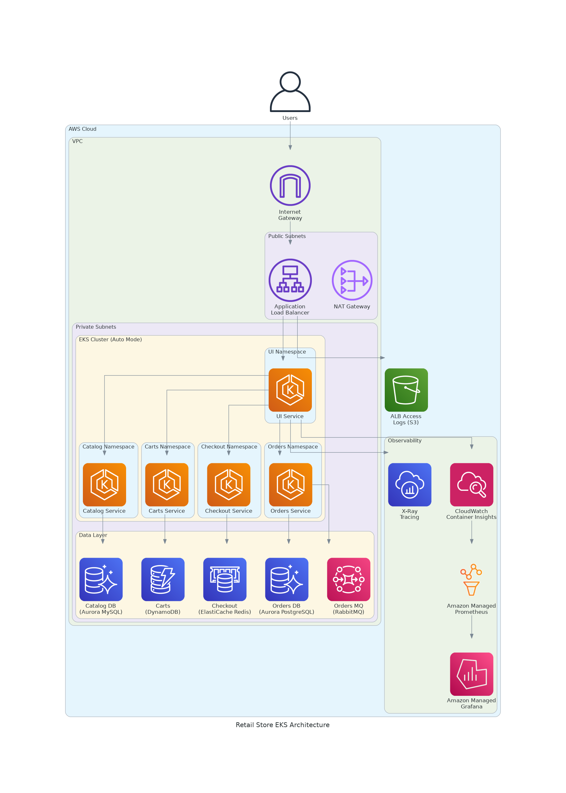

# AWS DevOps Agent Workshop - EKS Sample

> **🚀 Quick Start:** Run `./terraform/deploy.sh` to deploy the complete environment in one command.

---

## What is this Workshop?

This is a hands-on workshop designed to demonstrate the investigation capabilities of **AWS DevOps Agent** - an AI-powered assistant that automatically diagnoses and troubleshoots infrastructure issues in your AWS environment.

### How it Works

1. **Deploy** a real microservices application (Retail Store) on Amazon EKS
2. **Inject faults** using provided scripts that simulate real-world production issues
3. **Investigate** using AWS DevOps Agent with natural language prompts
4. **Learn** how the agent analyzes logs, metrics, traces, and configurations to identify root causes

### What You'll Learn

- How AWS DevOps Agent investigates infrastructure issues across EKS, RDS, DynamoDB, and more
- Common failure patterns in Kubernetes environments (CPU stress, memory leaks, network issues)
- How to use natural language to troubleshoot complex distributed systems
- Best practices for diagnosing performance degradation, connectivity failures, and resource exhaustion

### Workshop Flow

```
┌─────────────────┐     ┌─────────────────┐     ┌─────────────────┐     ┌─────────────────┐
│  Deploy EKS     │ ──▶ │  Inject Fault   │ ──▶ │  Investigate    │ ──▶ │  Learn & Fix    │
│  Environment    │     │  (Break things) │     │  with DevOps    │     │  (Rollback)     │
│                 │     │                 │     │  Agent          │     │                 │
└─────────────────┘     └─────────────────┘     └─────────────────┘     └─────────────────┘
```

---

> **⚠️ Disclaimer:** This repository includes intentional fault injection scenarios designed to demonstrate the AWS DevOps Agent's investigation capabilities. **Do not run these scripts in production environments.**

> **📦 Source Code:** The Retail Store Sample Application source: https://github.com/aws-containers/retail-store-sample-app

---

## Table of Contents

- [Quick Start](#-quick-start)
- [Architecture Overview](#architecture-overview)
- [Manual Deployment](#manual-deployment)
- [AWS DevOps Agent Setup](#aws-devops-agent-setup)
- [Fault Injection Scenarios](#fault-injection-scenarios)
- [Cleanup](#cleanup)

---

## 🚀 Quick Start

### Prerequisites

Install these tools before deploying:

| Tool | Installation |
|------|-------------|
| AWS CLI | [Install Guide](https://aws.amazon.com/cli/) |
| Terraform | [Install Guide](https://developer.hashicorp.com/terraform/downloads) |
| kubectl | [Install Guide](https://kubernetes.io/docs/tasks/tools/) |

Configure AWS credentials:
```bash
aws configure
# Enter your AWS Access Key ID, Secret Access Key, and default region (us-east-1)
```

### One-Click Deployment

```bash
# Clone the repository
git clone https://github.com/aws-samples/sample-devops-agent-eks-workshop.git
cd sample-devops-agent-eks-workshop

# Deploy everything (~25-30 minutes)
./terraform/deploy.sh
```

The script will:
1. ✅ Check prerequisites (Terraform, kubectl, AWS CLI)
2. ✅ Deploy EKS cluster with all dependencies
3. ✅ Configure kubectl access
4. ✅ Wait for application pods to be ready
5. ✅ Display the application URL and next steps

**Customize deployment:**
```bash
# Custom cluster name and region
CLUSTER_NAME=my-cluster AWS_REGION=us-west-2 ./terraform/deploy.sh

# Enable Amazon Managed Grafana (requires AWS SSO)
ENABLE_GRAFANA=true ./terraform/deploy.sh
```

---

## Architecture Overview

The Retail Store Sample App is a microservices e-commerce application demonstrating AWS service integrations:



### Microservices

| Service | Language | Backend | Description |
|---------|----------|---------|-------------|
| UI | Java | - | Store user interface |
| Catalog | Go | Aurora MySQL | Product catalog API |
| Carts | Java | DynamoDB | Shopping carts API |
| Orders | Java | Aurora PostgreSQL + RabbitMQ | Orders API |
| Checkout | Node.js | Redis | Checkout orchestration |

### Infrastructure Components

**Deployed by Terraform:**
- Amazon EKS (v1.34) with EKS Auto Mode
- Amazon VPC with public/private subnets across 3 AZs
- Amazon Aurora MySQL & PostgreSQL
- Amazon DynamoDB
- Amazon MQ (RabbitMQ)
- Amazon ElastiCache (Redis)
- CloudWatch Container Insights with Application Signals
- Amazon Managed Prometheus

**Resource Tagging:**
All resources are tagged with `devopsagent = "true"` for automatic discovery by the AWS DevOps Agent.

---

## Manual Deployment

If you prefer step-by-step deployment instead of the deploy script:

```bash
# Navigate to Terraform directory
cd terraform/eks/default

# Initialize and deploy
terraform init
terraform plan
terraform apply

# Configure kubectl
aws eks update-kubeconfig --name retail-store --region us-east-1

# Verify deployment
kubectl get pods -A | grep -E "carts|catalog|orders|checkout|ui"
```

### Configure EKS Access Entry

After deployment, add your IAM role to the cluster:

```bash
# Get your IAM identity
aws sts get-caller-identity

# Create access entry (replace YOUR_ROLE_ARN)
aws eks create-access-entry \
  --cluster-name retail-store \
  --principal-arn YOUR_ROLE_ARN \
  --type STANDARD

aws eks associate-access-policy \
  --cluster-name retail-store \
  --principal-arn YOUR_ROLE_ARN \
  --policy-arn arn:aws:eks::aws:cluster-access-policy/AmazonEKSClusterAdminPolicy \
  --access-scope type=cluster
```

---

## AWS DevOps Agent Setup

AWS DevOps Agent automatically investigates and diagnoses infrastructure issues. Follow these steps to integrate it with your deployment.

> **Note:** AWS DevOps Agent is in **public preview** and available in **US East (N. Virginia)** (`us-east-1`).

### Step 1: Create an Agent Space

1. Open the [AWS DevOps Agent console](https://console.aws.amazon.com/devops-agent/home?region=us-east-1)
2. Click **Create Agent Space +**
3. Configure:
   - **Name:** `retail-store-eks-workshop`
   - **AWS resource access:** Select **Auto-create a new AWS DevOps Agent role**
4. **Add tag filter** (required for Terraform-deployed resources):
   - Tag Key: `devopsagent`
   - Tag Value: `true`
5. **Enable Web App:** Select **Auto-create a new AWS DevOps Agent role**
6. Click **Submit**

### Step 2: Configure EKS Access

The DevOps Agent needs Kubernetes API access to investigate pod issues.

1. In your Agent Space, go to **Capabilities** → **Cloud** → **Primary Source** → **Edit**
2. Follow the console instructions to grant EKS access

For detailed instructions: [AWS EKS access setup documentation](https://docs.aws.amazon.com/devopsagent/latest/userguide/configuring-capabilities-for-aws-devops-agent-aws-eks-access-setup.html)

### Step 3: Start an Investigation

1. Click **Operator access** to open the Web App
2. Click **Start Investigation**
3. Describe the issue (e.g., "Product pages are loading slowly")
4. Watch the agent analyze logs, metrics, and traces automatically

---

## Fault Injection Scenarios

Work through hands-on troubleshooting scenarios using AWS DevOps Agent to investigate and resolve issues in your EKS retail store application.

> **⚠️ Important:** The symptoms from these fault injections may not be visible in the website URL. Do not look for symptoms in the browser. Instead, check symptoms using `kubectl` commands as shown in each lab below.

### Investigation Flow

Each lab follows a consistent pattern:

1. **Inject the Issue** - Run the inject script to create the fault
2. **Observe Symptoms** - Use kubectl commands to observe the impact
3. **Investigate with DevOps Agent** - Use natural language to troubleshoot
4. **Identify Root Cause** - Let the agent guide you to the issue
5. **Apply Fix** - Run the rollback script to restore normal operation

### Setup

```bash
cd fault-injection
chmod +x *.sh
```

### Quick Reference

| Lab | Inject | Fix | Impact |
|-----|--------|-----|--------|
| 1. Catalog Latency | `./inject-catalog-latency.sh` | `./rollback-catalog.sh` | Slow product pages |
| 2. Cart Memory Leak | `./inject-cart-memory-leak.sh` | `./rollback-cart-memory-leak.sh` | Cart service crashes |
| 3. RDS Security Group | `./inject-rds-sg-block.sh` | `./rollback-rds-sg-block.sh` | Database unreachable |
| 4. DynamoDB Stress | `./inject-dynamodb-stress.sh` | `./rollback-dynamodb-stress.sh` | Slow cart operations |
| 5. Network Partition | `./inject-network-partition.sh` | `./rollback-network-partition.sh` | Website unreachable |

---

### Lab 1: Product Catalog Service Performance Degradation

#### Scenario

Retail website's product pages have suddenly become painfully slow, causing customers to abandon their shopping and complain about the "broken" site. This performance degradation is costing your company thousands of dollars per minute in lost sales and damaging customer relationships built over years.

Your task is to use AWS DevOps Agent to investigate the performance degradation and identify the root cause.

<details>
<summary><b>What does this lab do?</b></summary>

This lab modifies the catalog deployment to inject performance issues:

- Reduces main container CPU limits from 256m to 128m (throttling)
- Adds a stress sidecar with CPU workers at 100% load

This simulates:
- Runaway processes consuming CPU
- Resource contention issues
- Sidecar containers impacting main application
</details>

#### Step 1: Inject the Issue

```bash
./inject-catalog-latency.sh
```

You should see output confirming the issue has been injected.

#### Step 2: Observe the Symptoms

After injecting the issue:

```bash
# Check the pods associated with catalog namespace
kubectl get pods -n catalog

# Events: Look for node associated with this pod
kubectl get pods -n catalog -o wide
```

Open [Container Insights](https://us-east-1.console.aws.amazon.com/cloudwatch/home?region=us-east-1#container-insights:) to check the CPU utilization of underlying node. Observe CPU utilization spiking to 100% immediately after running the fault injection script.

#### Step 3: Troubleshoot with DevOps Agent

1. Launch DevOps Agent WebApp by clicking **Operator Access**
2. **Start an Investigation** using these prompts:

**Investigation details:**
```
The catalog service is experiencing performance issues. Users are complaining about product pages taking excessively long to load. Please analyze the logs for the catalog microservice to provide detailed analysis and identify the root cause of this performance degradation.
```

**Investigation starting point:**
```
Product page performance has become unacceptable, with load times exceeding 8-10 seconds instead of the normal 1-2 seconds. Analyze the catalog service pods' CPU utilization metrics to identify resource-related issues. Check for CPU throttling, resource limit violations, and any unusual consumption spikes that correlate with the performance degradation.
```

> **Note:** This investigation typically takes 20 to 30 minutes to complete. You can monitor the DevOps Agent's analysis progress in real-time during the investigation.

#### Step 4: Verification

After applying the fix:
1. Pods should show 1/1 containers (no sidecar)
2. CPU utilization should drop immediately
3. Response times should return to normal

#### Key Learnings

- **Sidecars can impact main container performance** - Resource limits apply per-container, not per-pod
- **DevOps Agent examines pod configuration** - Not just metrics, but actual deployment specs
- **Container-level visibility is essential** - Need to see individual container resource usage
- **Check for unexpected containers** - Sidecars, init containers, or injected containers

#### Cleanup

```bash
./rollback-catalog.sh
```

---

### Lab 2: Shopping Cart Service Keeps Crashing

#### Scenario

Cart service reliability has degraded significantly with pods restarting frequently and causing intermittent shopping cart failures. Customers are experiencing lost cart items and checkout disruptions as the service becomes unreliable during critical shopping moments. This restart pattern indicates potential resource exhaustion or memory issues affecting service stability.

Investigate the cart service instability using AWS DevOps Agent to restore reliable shopping cart functionality.

<details>
<summary><b>What does this lab do?</b></summary>

This lab modifies the cart deployment to inject a memory leak:

- Adds a sidecar container that continuously allocates memory
- Memory grows until it hits the container limit
- Kubernetes OOMKills the pod
- Pod restarts, memory grows again (CrashLoopBackOff)

This simulates:
- Memory leaks in application code
- Unbounded caches
- Large object accumulation
- Resource limit misconfiguration
</details>

#### Step 1: Inject the Issue

```bash
./inject-cart-memory-leak.sh
```

#### Step 2: Observe the Symptoms

After injecting the issue:

1. **Pod restarts** - Cart pods are restarting frequently
2. **CrashLoopBackOff** - Pods may enter CrashLoopBackOff state

```bash
# Watch cart pods for restarts
kubectl get pods -n carts -w
```

#### Step 3: Troubleshoot with DevOps Agent

Open AWS DevOps Agent and try these investigation prompts:

**Investigation details:**
```
The cart service has become unstable with pods experiencing frequent restarts and intermittent failures, causing customers to lose shopping cart items and encounter checkout disruptions. This service was functioning reliably until recently but now shows a pattern of repeated crashes and restarts that suggests resource-related issues. Investigate the pod restart patterns, container health, and resource consumption to identify what's causing these persistent stability problems affecting the shopping experience.
```

**Investigation starting point:**
```
Examine the cart service pods in the carts namespace that are showing frequent restart behavior. Focus on pod events, container status, and restart patterns to determine what's causing the repeated failures and service instability.
```

> **Note:** This investigation typically takes 20 to 30 minutes to complete, but timing may vary depending on system load and complexity.

#### Step 4: Verification

After applying the fix:
1. Pods should stabilize (no more restarts)
2. Memory usage should be stable
3. Cart operations should work consistently
4. Check: `kubectl get pods -n carts` shows 1/1 Ready

#### Key Learnings

- **OOMKilled indicates memory exhaustion** - Container exceeded its limit
- **Memory leaks cause intermittent failures** - Works until memory fills up
- **CrashLoopBackOff is a symptom** - The root cause is often resource exhaustion
- **Container Insights shows memory trends** - Look for steadily increasing memory
- **Check all containers in a pod** - Sidecars can cause issues too

#### Understanding OOMKilled

| Exit Code | Meaning |
|-----------|---------|
| 137 | Container was OOMKilled (128 + 9 SIGKILL) |
| 143 | Container received SIGTERM (graceful shutdown) |
| 0 | Normal exit |

#### Cleanup

```bash
./rollback-cart-memory-leak.sh
```

---

### Lab 3: Services Won't Connect to Database

#### Scenario

Multiple critical services have failed simultaneously with catalog and orders pods crashing repeatedly. Customers cannot browse products or complete purchases as these essential services are stuck in continuous restart loops. This sudden failure suggests an infrastructure connectivity issue rather than application bugs.

Investigate using AWS DevOps Agent to identify what's preventing database connections and restore service availability.

<details>
<summary><b>What does this lab do?</b></summary>

This lab modifies the RDS security groups to remove inbound rules that allow traffic from EKS nodes:

- **Catalog database** (Aurora MySQL, port 3306) - blocks product data access
- **Orders database** (Aurora PostgreSQL, port 5432) - blocks order processing

This simulates:
- Security group misconfiguration
- Accidental rule deletion
- Infrastructure drift
- Overly restrictive security changes
</details>

#### Step 1: Inject the Issue

```bash
./inject-rds-sg-block.sh
```

#### Step 2: Observe the Symptoms

After injecting the issue, wait 30-60 seconds for pods to restart and fail:

1. **Pods crash repeatedly** - Catalog and Orders pods enter `CrashLoopBackOff` state
2. **Services unavailable** - Catalog and Orders services are not responding

```bash
# Check the pod state of catalog service
kubectl get pods -n catalog -o wide --show-labels

# Log investigation
kubectl logs -n catalog -l app.kubernetes.io/name=catalog --tail=100 | grep -i "error\|fail\|connect"
```

#### Step 3: Troubleshoot with DevOps Agent

Open AWS DevOps Agent and try these investigation prompts:

**Investigation details:**
```
Multiple critical services have failed simultaneously with catalog and orders pods stuck in continuous crash loops. Both services were functioning normally until recently but now cannot complete startup, preventing customers from browsing products or placing orders. Investigate the startup failures and database connection errors to identify what's preventing these services from accessing their required databases.
```

**Investigation starting point:**
```
Examine the catalog namespaces where pods are showing CrashLoopBackOff status. Focus on container startup logs for database connection failures and analyze what could be blocking database access from the EKS cluster.
```

> **Note:** This investigation typically takes 10 to 20 minutes to complete, but timing may vary depending on system and complexity.

#### Step 4: Verification

After adding the rules:
1. Restart the pods: `kubectl rollout restart deployment/catalog -n catalog && kubectl rollout restart deployment/orders -n orders`
2. Wait for pods to become Ready: `kubectl get pods -n catalog -w`
3. Catalog pods should connect to MySQL and show "Running database migration..." in logs
4. Orders pods should connect to PostgreSQL and start successfully

#### Key Learnings

- **Security groups can silently break connectivity** - No errors in AWS console
- **Database health ≠ database accessibility** - RDS can be healthy but unreachable
- **Multiple databases = multiple security groups** - Each needs proper rules
- **Check security groups early** - Common cause of connectivity issues
- **DevOps Agent examines network configuration** - Including security groups
- **Infrastructure drift happens** - Manual changes can break things

#### Cleanup

```bash
./rollback-rds-sg-block.sh
```

---

### Lab 4: Cart Operations Extremely Slow

#### Scenario

The application is experiencing widespread performance issues with cart operations becoming noticeably slow and users encountering occasional timeouts. Instant cart functionality now takes several seconds to respond, impacting the shopping experience during critical business hours. This performance pattern suggests backend data store problems rather than application code issues.

Investigate the performance degradation using AWS DevOps Agent to restore normal application responsiveness.

<details>
<summary><b>What does this lab do?</b></summary>

This lab runs a Kubernetes Job that generates excessive DynamoDB requests:

- High-frequency read/write operations
- Large batch operations
- Scan operations (expensive)
- Exceeds provisioned capacity

This simulates:
- Traffic spikes
- Inefficient access patterns
- Missing indexes (requiring scans)
- Under-provisioned capacity
</details>

#### Step 1: Inject the Issue

```bash
./inject-dynamodb-stress.sh
```

> **Note:** This lab generates heavy DynamoDB traffic. The stress will automatically stop after 6 minutes.

#### Step 2: Observe the Symptoms

After injecting the issue:

```bash
# Check for any unusual pods
kubectl get pods -n carts
```

#### Step 3: Troubleshoot with DevOps Agent

Open AWS DevOps Agent and try these investigation prompts:

**Investigation details:**
```
The application is experiencing widespread performance degradation with cart operations becoming significantly slower than normal. Users are reporting that previously instant functionality like adding items to cart, updating quantities, and checkout processes now take several seconds to complete, with some operations timing out entirely. This performance issue appears to affect data-intensive operations while basic page browsing remains normal, suggesting a backend data store performance problem. Investigate the performance bottlenecks affecting cart functionality and identify what's causing the slowdown in data operations.
```

**Investigation starting point:**
```
Focus on the cart service and its data operations that are experiencing performance degradation. Examine backend data store metrics, application response times, and any unusual traffic patterns that could be causing the slowdown in cart functionality.
```

> **Note:** This investigation typically takes 10 to 20 minutes to complete, but timing may vary depending on complexity.

#### Step 4: Verification

After the stress stops:
1. Throttling should stop
2. Cart operations should return to normal speed
3. CloudWatch metrics should show reduced consumed capacity

#### Key Learnings

- **DynamoDB throttling causes application failures** - Not just slowness
- **Scans are expensive** - Consume much more capacity than queries
- **Monitor consumed capacity** - Catch issues before throttling
- **Auto-scaling helps** - But has limits and lag time
- **Design for your access patterns** - Use appropriate indexes

#### DynamoDB Metrics to Monitor

| Metric | Description | Warning Sign |
|--------|-------------|--------------|
| `ThrottledRequests` | Requests that exceeded capacity | Any value > 0 |
| `ConsumedReadCapacityUnits` | RCUs consumed | Near provisioned limit |
| `ConsumedWriteCapacityUnits` | WCUs consumed | Near provisioned limit |
| `SuccessfulRequestLatency` | Request latency | Increasing trend |
| `SystemErrors` | DynamoDB internal errors | Any value > 0 |

#### Cleanup

```bash
./rollback-dynamodb-stress.sh
```

---

### Lab 5: Website Completely Unreachable

#### Scenario

A complete website blackout has occurred during your busiest shopping period - customers cannot access any part of your retail site, causing immediate revenue loss and customer frustration. Unlike performance issues, this is a total service failure where the application appears healthy internally but is completely unreachable by users, suggesting a network-level problem.

Your task is to use AWS DevOps Agent to quickly identify what's blocking customer access and restore the website before the business impact becomes catastrophic.

<details>
<summary><b>What does this lab do?</b></summary>

This lab applies a NetworkPolicy that blocks all ingress traffic to the UI pods. This simulates:

- Misconfigured network policies
- Security team applying overly restrictive rules
- Namespace isolation gone wrong
</details>

#### Step 1: Inject the Issue

```bash
./inject-network-partition.sh
```

#### Step 2: Observe the Symptoms

After injecting the issue:

```bash
# Check UI pods status (should be Running)
kubectl get pods -n ui

# Check for NetworkPolicies
kubectl get networkpolicy -n ui
```

The `deny-ingress-to-ui` NetworkPolicy blocks all incoming connections to UI pods. Open the application URL in your browser - the page should fail to load or timeout.

#### Step 3: Troubleshoot with DevOps Agent

Open AWS DevOps Agent and try these investigation prompts:

**Investigation details:**
```
UI pod unreachable from other pods in cluster. Pod-to-pod communication failing. Use EKS audit logs in CloudWatch for networking/RBAC investigation
```

**Investigation starting point:**
```
Check pod state and Services via K8s API. For NetworkPolicies and Endpoints, query CloudWatch audit logs (/aws/eks/retail-store/cluster). Then check AWS networking (SGs, NACLs), then application logs. Work from network layer up to application layer
```

> **Note:** This investigation typically takes 20 to 30 minutes to complete, but timing may vary depending on complexity.

#### Step 4: Verification

After removing the policy:
1. Refresh the browser - website should load
2. Check no blocking policies exist: `kubectl get networkpolicy -n ui`

#### Key Learnings

- **Network policies can make services unreachable** - Pods appear healthy but can't receive traffic
- **Check NetworkPolicies early** - Often overlooked during troubleshooting
- **Pod health ≠ reachability** - A healthy pod may still be unreachable due to network blocks
- **DevOps Agent checks network configuration** - Not just application health

#### Cleanup

```bash
./rollback-network-partition.sh
```

---

### 🎉 Congratulations!

You've completed all 5 troubleshooting labs! You've learned how to use AWS DevOps Agent to investigate and resolve:

- Performance issues (CPU stress, latency)
- Network connectivity problems (NetworkPolicy, Security Groups)
- Resource exhaustion (Memory leaks, DynamoDB throttling)

### Tips for Using DevOps Agent

When investigating issues, try prompts like:
- "Why is the catalog service slow?"
- "Check the health of my EKS pods"
- "What's causing high CPU on the catalog service?"
- "Show me recent errors in the orders service logs"
- "Why is the website not loading?"
- "Are there any pod restarts or OOMKills?"

The DevOps Agent will analyze your infrastructure, check logs, metrics, and configurations to help identify the root cause.

---

## Cleanup

### Quick Cleanup (Recommended)

```bash
./terraform/destroy.sh
```

The script handles:
- AWS auto-provisioned resources (GuardDuty VPC endpoints, security groups)
- Terraform-managed resources
- CloudWatch log groups

### Manual Cleanup

```bash
cd terraform/eks/default
terraform destroy
```

---

## Additional Resources

| Resource | Link |
|----------|------|
| AWS DevOps Agent Documentation | [User Guide](https://docs.aws.amazon.com/devopsagent/latest/userguide/) |
| AWS DevOps Agent Console | [Console](https://console.aws.amazon.com/devops-agent/home?region=us-east-1) |
| Retail Store Sample App | [GitHub](https://github.com/aws-containers/retail-store-sample-app) |

---

## License

This project is licensed under the MIT-0 License. See the [LICENSE](LICENSE) file.
